## Table of Contents
- [Overview](#overview)
- [Data Cleaning](#data-cleaning)
- [Exploratory Data Analysis](#exploratory-data-analysis)
    - [Inspecting the dataset](#inspecting-the-dataset)
    - [Question 1](#question-1)
    - [Question 2](#question-2)
    - [Question 3](#question-3)
    - [Question 4](#question-4)
    - [Question 5](#question-5)
- [Data Processing](#data-processing)
- [PCA for Feature Selection](#pca-for-feature-selection)
- [Correlation Analysis](#correlation-analysis)
- [SMOTE Resampling](#smote-resampling)
- [Methodology](#methodology)
- [Baseline Models](#baseline-models)
- [Hyperparameter Optimization](#hyperparameter-optimization)
    - [Logistic Regression](#logistic-regression)
    - [Random Forest](#random-forest)
    - [Support Vector Machine](#support-vector-machine)
    - [K-nearest Neighbors](#k-nearest-neighbors)
- [Model Evaluation](#model-evaluation)
- [ROC AUC Curve](#roc-auc-curve)
- [Conclusion](#conclusion)


## Overview
Telco is a company providing home phone and internet services to 7,043 customers in California. The dataset provide relevant customer churn information based on a varity of factors including demographic information, customer account information, types of provided services, and churn status.

The aim of the analysis is to identify leading factors that drive exsiting customers to defect, and stregthen the company's customer retention strategies in order to reduce the churn rate.

## Data Cleaning

```python
# Import necessary libraries
import pandas as pd
import numpy as np
import matplotlib.pyplot as plt
import seaborn as sns
from scipy.stats import pearsonr
from MyFunctions import text_annotate, add_median_labels

from sklearn.preprocessing import StandardScaler
from sklearn.model_selection import train_test_split
from sklearn.linear_model import LogisticRegression
from sklearn.tree import DecisionTreeClassifier
from sklearn.ensemble import RandomForestClassifier
from sklearn.metrics import confusion_matrix, classification_report 
from sklearn.metrics import accuracy_score, precision_score, recall_score
from sklearn.model_selection import GridSearchCV
from scipy.stats import randint
from sklearn.model_selection import RandomizedSearchCV
from sklearn.svm import SVC, LinearSVC
from imblearn.over_sampling import SMOTE
from sklearn.decomposition import PCA
from sklearn.neighbors import KNeighborsClassifier
from sklearn.metrics import roc_auc_score, roc_curve, precision_recall_curve, auc
```
There are 11 customers with missing `TotalCharges`. The rows with missing information are removed as they are very small amount. 

```python
# Import dataset
telco_raw = pd.read_csv('/Users/pangiiez/workspace/telco.csv',skipinitialspace=True)

# Check and Drop NaN values
telco_raw.isna().sum() 
telco = telco_raw.dropna()
```
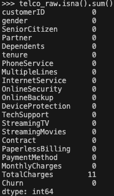

Additional categories on customer's reponses containing `No phone service` and `No internet service` are converted to `No`. 

`SeniorCitizen` column is reassigned to `Yes` and `No`.

```python
# SeniorCitizen convert to yes/no | other to yes/no
telco['SeniorCitizen'] = telco['SeniorCitizen'].replace({0:'No', 1:'Yes'})

for column in telco.columns:
    if 'No internet service' in telco[column].to_string():
        telco[column] = telco[column].replace({'No internet service':'No'})

telco['MultipleLines'] = telco['MultipleLines'].replace({'No phone service':'No'})
telco['PaymentMethod'] = telco['PaymentMethod'].replace({'Electronic check':'E-check','Bank transfer (automatic)':'Auto Bank transfer', 'Credit card (automatic)':'Auto Credit card'})
```
## Exploratory Data Analysis

### Inspecting the dataset
**Table 1** summarises the total number of male and female customers, an average number of months customers subscribed for services, and an average monthly charges. The dataset has almost an equal demographic composition of male and female customers, with slightly different period of customer tenure between both groups and monthly charges. 

The average tenure is around 32 months for both men and women. The montly bills cost approximately 64 USD for male clients, and 65 USD for female clients.

```python
telco_summary = telco[['gender', 'tenure', 'MonthlyCharges']]
telco_summary = telco_summary.groupby('gender').agg({'gender':'count','tenure':'mean','MonthlyCharges':'mean'})
telco_summary = telco_summary.rename(columns = {'gender':'Number of Observations','tenure':'Tenure','MonthlyCharges':'Monthly Charges'})
telco_summary = telco_summary.rename_axis('Gender')
print(telco_summary)
```


### Question 1
How much is the the customer churn rate of telco company? and which services did the churners subscribe for?

**Figure 1** illustrates the customer churn rate showing the percenate of subscribers who discontinued service subscriptions with Telco company. Out of 7,032 total customers, there were 1,869 customers or 26.6% who churned, leaving 5,163 customers which accounted for 73.4% with the company.

```python
telco_churn = telco['Churn'].value_counts()
colors = sns.color_palette('crest')
labels = ['Non-churners', 'Churners']

plt.style.use('fivethirtyeight')
fig, axs = plt.subplots(1,2, figsize=(15,7))
axs[0].bar(telco_churn.index, telco_churn.values, color=colors)
text_annotate(axs[0],'',0.4)
axs[0].set_title('Churn Outcome Distributions', weight='bold', fontsize=13)
axs[0].set_xticklabels(labels)
axs[1].pie(telco_churn, labels=labels, autopct='%1.1f%%', colors=colors, 
          explode=[0.03 for i in telco_churn.value_counts().index],shadow=True) 
axs[1].set_title('Percentage of Churn Outcome', weight='bold', fontsize=13)
plt.tight_layout()
plt.show()
```
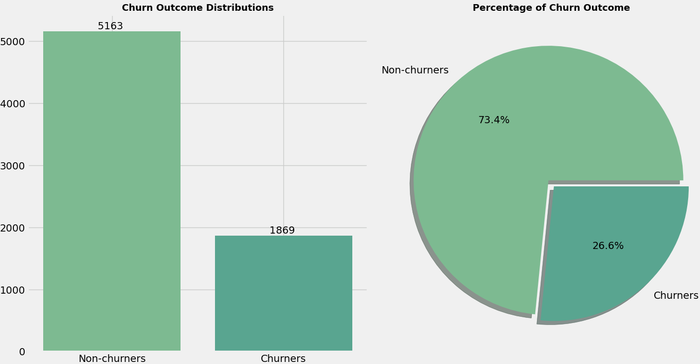

**Figure 2** delineates the distribution of subscriptions for Phone and Internet Service. It is apparent that phone service had the most subscribers with a total number of 4,653 customers, while the number of churners stood at 1,699 - more than one-third of the existing customers.

Telco company offers two types of interner service plans - DSL and Fiber opic internet services. Both plans added up the total number of 3,756 subscribers, with the former amounting at 1,957 customers and the latter totalling 1,799 customers.

Despite nearly 1,800 subscriptions for fiber optic internet service, the number of churners was as high as 1,297. The figure indicates that services offered to fiber optic subscribers require more attention.

```python
service_churn = telco[['PhoneService','InternetService','Churn']]
phone_service_churn = service_churn.groupby(['Churn','PhoneService']).size().reset_index()
internet_service_churn = service_churn.groupby(['Churn','InternetService']).size().reset_index()
fig, axs = plt.subplots(1, 2, figsize=(15, 7), sharey=True)
phone_service_churn_plot = sns.barplot(data=phone_service_churn, x='PhoneService',y=0,hue='Churn',palette=colors,ax=axs[0])
axs[0].set_xlabel('')
axs[0].set_ylabel('Total Number of Customers')
axs[0].set_xticklabels(['No phone service', 'Has phone service'])
axs[0].set_title('Phone Service', weight='bold',fontsize=13)
axs[0].legend('')
text_annotate(axs[0],'',0.2)
internet_service_churn_plot = sns.barplot(data=internet_service_churn,x='InternetService',y=0,hue='Churn',palette=colors,ax=axs[1])
axs[1].set_xlabel('')
axs[1].set_ylabel('')
axs[1].set_xticklabels(['DSL', 'Fiber optic','No internet service'])
axs[1].set_title('Internet Service', weight='bold',fontsize=13)
axs[1].legend('')
text_annotate(axs[1],'',0.2)
handles = [x for x,y in zip(axs[0].get_legend_handles_labels(), axs[1].get_legend_handles_labels())]
labels = labels
fig.legend(handles[0], labels, loc='lower center',ncol=2, bbox_to_anchor=(0.5, -0.03))
plt.tight_layout()
plt.show()
```
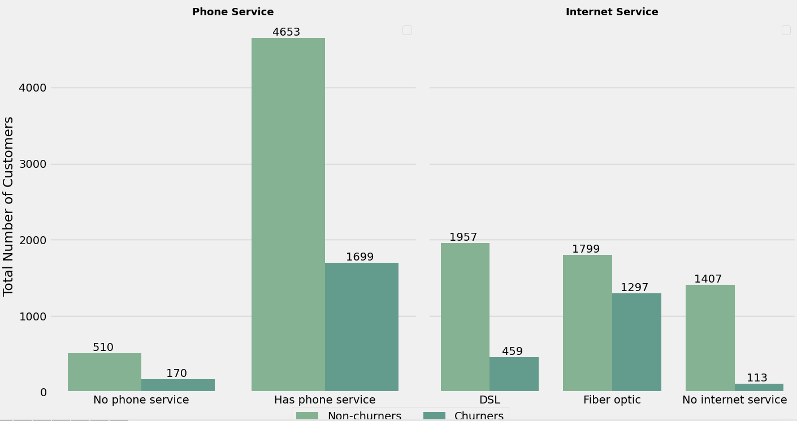

### Question 2
Which contract type has the most churners?

**Figure 3** depicts the average tenure period of customers per contract type. The company has three contract types - month-to-month, one year, and two years. It is evident that more customers churn at lowest contract period type (month-to-month contract) with around two fifths of its total subscribers, while longer contract type (two-year contract) lost only 3%.

```python
telco_contract = telco[['Contract','Churn']].groupby(['Contract','Churn']).agg({'Churn': 'count'})
telco_contract['percentage'] = 100 * telco_contract['Churn'] / telco_contract.groupby('Contract')['Churn'].transform(sum)
telco_contract = telco_contract.rename(columns={'Churn':'total'}).reset_index()
telco_contract
telco_contract_plot = sns.barplot(data=telco_contract, x='Contract', y='percentage', hue='Churn', palette=colors)
text_annotate(telco_contract_plot,'%',.2)
h = telco_contract_plot.get_legend_handles_labels()
l = labels
telco_contract_plot.legend(h[0], l, loc='upper center', bbox_to_anchor=(0.5, -0.05),
          fancybox=True, ncol=2)
plt.xlabel('')
plt.ylabel('')
plt.title('Average Customers per Contract Type', weight='bold',fontsize=13)
plt.tight_layout()
plt.show()
```
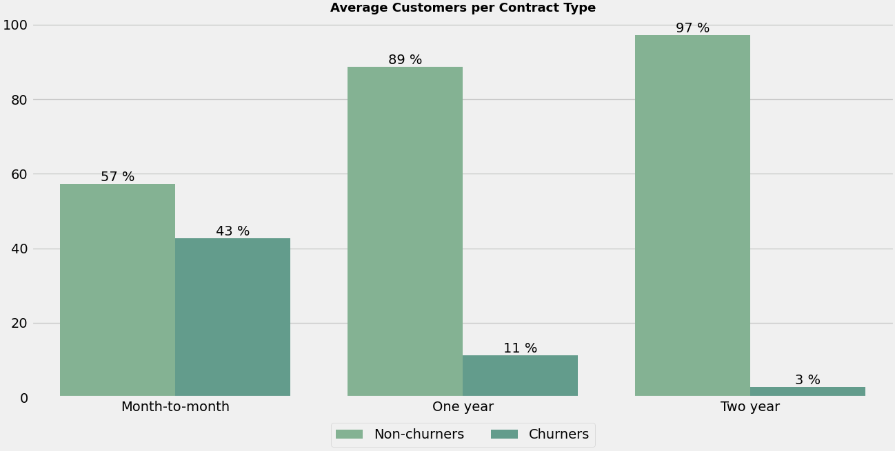

### Question 3
Is there any different between the average tenure of churn customers and the average tenure of customers in general?

**Figure 4** details the the distributions of tenure period between the existing customers and those who discontinued the service with Telco company. The average tenure period of the the existing clients was at around 38 months, while the customers who churned had an average of 18 months with the company.

The dashed line represents an average tenure period of the total number of customers in the dataset, standing at around 32 months. 

The significant different between the average tenure of churn customers (18 months) and the average tenure period of all customers (32 months) indicates that a large number of existing customers prone to defect. Therefore, the company should focus on strengtening its customer rentiontion policy in order to maintain the well-established clients.

```python
telco_avg_tenure = telco.groupby('Churn')['tenure'].mean()
telco_avg_tenure_cust = telco['tenure'].mean()

telco_avg_tenure_plot = sns.barplot(x=telco_avg_tenure.index, y=telco_avg_tenure.values,palette=colors)
text_annotate(telco_avg_tenure_plot, 'months')
telco_avg_tenure_plot.set_xticklabels(labels,fontsize=12)
telco_avg_tenure_plot.set_xlabel('')
telco_avg_tenure_plot.set_ylabel('Total Number of Months')
telco_avg_tenure_plot.axhline(telco_avg_tenure_cust, linestyle='--', label='Average Tenure = 32 months',color='k',lw=2)
telco_avg_tenure_plot.legend(loc ='upper right',fontsize=12)
telco_avg_tenure_plot.set_title('Average Tenure of Churners VS Average Tenure of all Customers',fontsize=13,weight='bold')
plt.tight_layout()
plt.show()
```
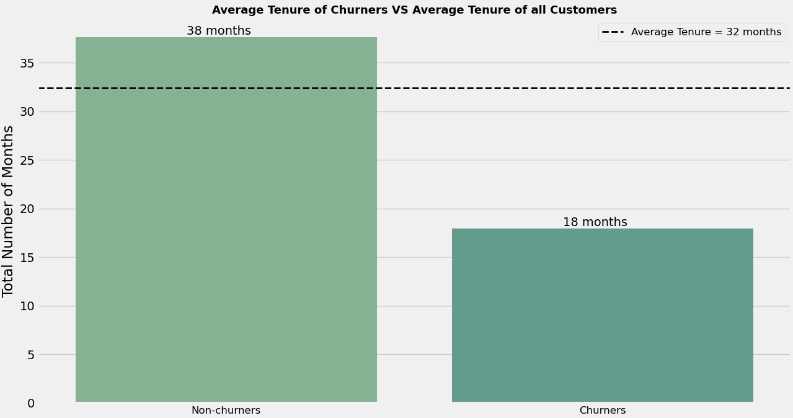

### Question 4
Which group of customers has the longest tenure periods and higest monthly spending?

**Figure 5** illustrates the distribution of tenure period of customers and amount of monthly spending according to demographic composition, namely whether or not a customer is a senior citizen? does a customer have partner?, and does a customer have dependents? 

It is observed that the distribution of customer tenure period at the median of younger customers as well as customers who did not have a partner or dependents was lower than senior customers and those who had a partner or dependents. Customers with a partner had the longest tenure period of 46 months at the median, followed by those with dependents and senior clients. 

In terms of monthly spending, senior clients had the highest monthly spending amount, amouting to 84.4 USD, with 87 people having extremely low spending amount of less than 35 USD per month. The shorter boxplot of senior subscribers suggests the difference in spending range between senior and younger clients. The overall spending of senior clients was far higher  between around 70-90 USD per month compared to that of younger ones whose speding range was more varying between 25-85 USD per month.

It is also observed that, despite shorter tenure period, customers with no dependents paid more monthly bill than those with dependents. Customers with a partner is; on the other hand, seen to have around the same spending as those with one even though their tenure period was considerably shorter.

```python
demo_tenure = telco[['SeniorCitizen','Partner','Dependents','tenure']]
demo_tenure = pd.melt(demo_tenure, id_vars=['tenure'], value_vars=['SeniorCitizen','Partner','Dependents'])
demo_mc = telco[['SeniorCitizen','Partner','Dependents','MonthlyCharges']]
demo_mc = pd.melt(demo_mc, id_vars=['MonthlyCharges'], value_vars=['SeniorCitizen','Partner','Dependents'])
demo_mc
fig, axs = plt.subplots(1, 2, figsize=(15,8))
demo_tenure_plot = sns.boxplot(data=demo_tenure, x='variable',y='tenure',hue='value', palette=colors,linewidth=0.5,ax=axs[0])
demo_tenure_plot.xaxis.set_ticks_position('top')
demo_tenure_plot.xaxis.set_label_position('top')
axs[0].set_title('Customer Tenure Period', weight='bold',fontsize=13)
axs[0].set_ylabel('Total Number of Months',fontsize=13)
axs[0].set_xlabel('')
axs[0].legend(loc='upper center', bbox_to_anchor=(0.5, -0.05),
           fancybox=True, ncol=2)
add_median_labels(demo_tenure_plot)
demo_mc_plot = sns.boxplot(data=demo_mc, x='variable',y='MonthlyCharges',hue='value', palette=colors,linewidth=0.5,ax=axs[1])
demo_mc_plot.xaxis.set_ticks_position('top')
demo_mc_plot.xaxis.set_label_position('top')
axs[1].set_title('Monthly Charges', weight='bold',fontsize=13)
axs[1].set_ylabel('USD')
axs[1].set_xlabel('')
axs[1].legend(loc='upper center', bbox_to_anchor=(0.5, -0.05),
           fancybox=True, ncol=2)
add_median_labels(demo_mc_plot)
plt.tight_layout()
plt.show()

telco[(telco['SeniorCitizen'] == 1) & (telco['MonthlyCharges'] < 35)]
```
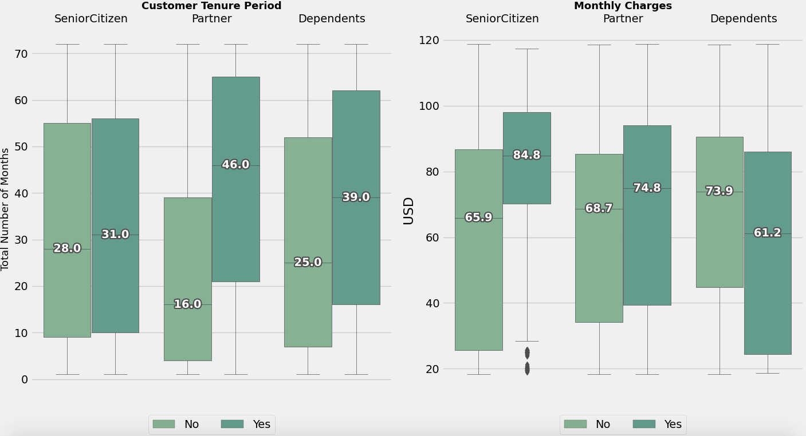

### Question 5
What is the correlation among the variables?

**Figure 6** depicts the relationship among all relavant factors. The following are trends to be observed;
- The positive correlation between tenure period as well as contract and total charges suggests that the longer customers continue their subscriptions, the more amount of fees charged to customers.
- Customers are likely to churn if they have shorter Tenure period and Contract type. 

```python
df_telco = pd.DataFrame(telco).drop(['customerID','gender'], axis=1)

for column in df_telco.columns:
    if df_telco[column].dtypes == object:
       df_telco[column] = df_telco[column].astype('category').cat.codes

g = sns.heatmap(df_telco.corr(),  xticklabels=True, yticklabels=True, cmap='BrBG', annot=True, fmt=".1f")
g.set_yticklabels(g.get_yticklabels(), fontsize = 10)
g.set_xticklabels(g.get_xticklabels(), fontsize = 10)
plt.tight_layout()
plt.show()
```
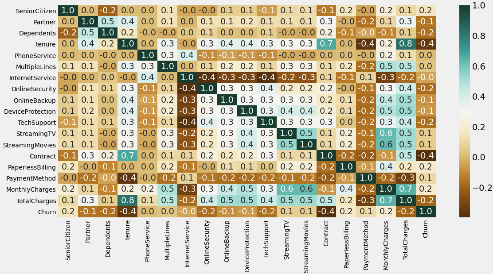

## Data Processing
`Churn` is defined as target variable. Columns are also separated into categorical and numerical columns.

```python
# Separate the feature and target variables
target = ['Churn']

# Separate categorical and numeric column names as lists
categorical = telco.nunique()[telco.nunique()<5].keys().tolist()
numerical = [col for col in telco.columns if col not in target+categorical]
```


Variables in categorical columns are transformed into binary columns with ones and zeros, instead of a text before building a data frame `telcom`.

```python
# Perform one-hot coding
telcom = pd.get_dummies(data=telco, columns=categorical, drop_first=True)

# Build DataFrame
telcom = pd.DataFrame(telcom)
print(telcom)
```


Prior to performing train/test split, feature and target columns are defined. 

The feature columns consists of all columns, except `customerID` . The target variable is what is going to be used as prediction outcome. In this regard, `Churn_yes` will be used.

```python
cols = [col for col in telcom.columns if col not in 'Churn_Yes']
target_col = ['Churn_Yes']
```


The dataset is split into train and test sets in order for the model to learn an effective mapping of inputs and outputs. The percentage of test size is 0.25 (25%), and the remainder of 0.75 (75%) is assigned to the train set.

```python
X_train, X_test, Y_train, Y_test = train_test_split(telcom[cols], telcom[target_col], test_size=.25, random_state=42)
```
The next step is to transform the numerical features into unit scale with average of 0 and standard deviation of 1. This pre-processing step helps to prevent variables with larger mean and standard deviation values from having more influence as predictors. 

In order to prevent data leakage, scaling is only applied to the training set before fitting the model. That is, **fit** and **transform** will be applied to the training data (`X_train`), whereas **transform** is used for the testing data (`X_test`).

```python
# Scaling the data
scaler = StandardScaler()
to_scale = [col for col in telcom.columns if telcom[col].max() > 1]
X_train[to_scale]

X_train[['SC_tenure','SC_MonthlyCharges', 'SC_TotalCharges']] = scaler.fit(X_train[to_scale])
X_train[['SC_tenure','SC_MonthlyCharges', 'SC_TotalCharges']] = scaler.transform(X_train[to_scale])
X_test[['SC_tenure','SC_MonthlyCharges', 'SC_TotalCharges']] = scaler.transform(X_test[to_scale])

# Drop unscaled columns
X_train = X_train.drop(['tenure', 'MonthlyCharges', 'TotalCharges'], axis=1)
X_test = X_test.drop(['tenure', 'MonthlyCharges', 'TotalCharges'], axis=1)

# Rename
X_train = X_train.rename(columns={'SC_tenure':'tenure','SC_MonthlyCharges':'MonthlyCharges','SC_TotalCharges':'TotalCharges'})
X_test = X_test.rename(columns={'SC_tenure':'tenure','SC_MonthlyCharges':'MonthlyCharges','SC_TotalCharges':'TotalCharges'})
```


## PCA for Feature Selection
Principal Component Analysis (PCA) is used for dimensionality reduction and feature importance determination. PCA is only applied to `X_train`.

```python
pca = PCA(n_components=None)
pca = pca.fit(X_train)
```
**Figure 7** shows the percentage of cumulative sum of eigenvalues. It represents the variation that each component accounts for. This scree plot suggets that we can explain around 85% of the variance in the dataset with 11 principal components (out of 23 components).

```python
plt.plot(pca.explained_variance_ratio_.cumsum() * 100, lw=3, color='#087E8B')
plt.title('Cumulative explained variance by number of principal components', weight='bold')
plt.xlabel("Number of components (Dimensions)")
plt.ylabel("Explained variance (%)")
plt.tight_layout()
plt.show()
```
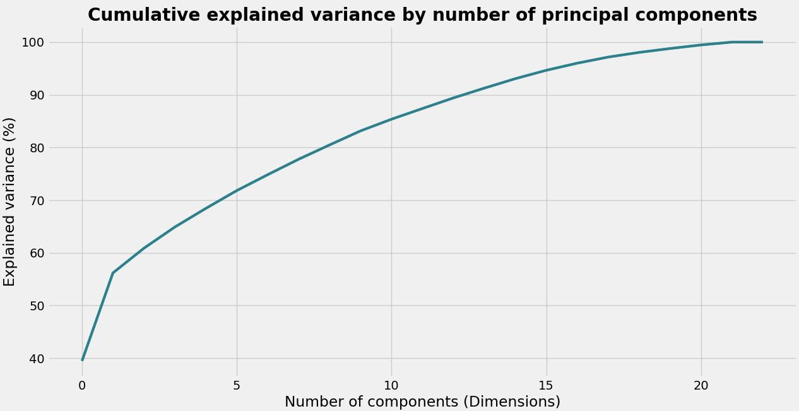

**Table 2** shows the loading scores of each component. These are the coefficients of the variables which explain how the principal components are constructed from the original variables. 

The loading scores can be used to find correlations between the variables and principal components - stronger correlation means that the feature is important. 

Considering PC1 column, the correlation coefficient between PC1 and `TotalCharges` is 95%, indicating a very strong positive correlation.

```python
loadings = pd.DataFrame(
    data=pca.components_.T * np.sqrt(pca.explained_variance_), 
    columns=[f'PC{i}' for i in range(1, len(X_train.columns) + 1)],
    index=X_train.columns
)

print(loadings.sort_values(by='PC1',ascending=False))
```
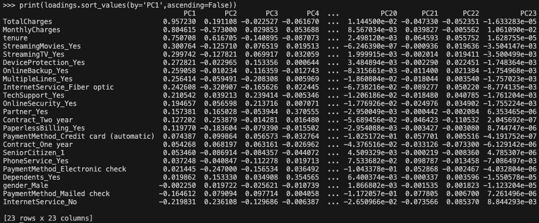

## Correlation Analysis
PCA is applied onto the dataset. The principal components are new variables constructed as linear combinations or mixtures of the initial variables. PCA 
chooses the minimum number of principal components such that 85% of the variance is captured. In this case, 85% of the variance amounts to 11 principal components or variables.

```python
pca = PCA(.85)
X_train_pca = pca.fit_transform(X_train)
X_test_pca = pca.transform(X_test)

print(f'''Total number of components is: {pca.n_components_} components''')
```


In order for the model to be stable and produce realiable estimate of the target variable, it is important that these predictors are not correlated with one another. 

**Figure 8** illustrates the correlation matrix showing that after applying PCA , the correlation coefficient of the variables is less than 0. This indicates the absence of a linear relationship between them. 

```python
X_pca = pd.DataFrame(X_train_pca)
fig = plt.figure(figsize=(10, 8))
sns.heatmap(X_pca.corr(), 
            annot=True,cmap='GnBu')
plt.show()
```
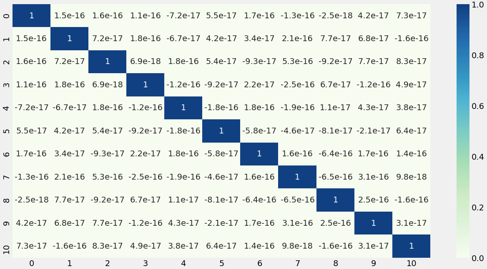

## SMOTE Resampling
It is seen from **figure 1** which delineates the percentage of churn outcomes with 73% of non-churners but only 26.6% of churners. This imbalanced classification may lead to low quality of predictive ability. 

To counter the problem, SMOTE resampling is used to balance the class distribution and increase the variety of sample domain. 

SMOTE is only applied to the training set in order to prevent data leakage into the test set so that the result is generalizable. 

After applying SMOTE, the shape of feature variables amounts to 7,726, with balanced positive and negative outcomes.

```python
sm = SMOTE(random_state=42)

X_train_sm, Y_train_sm = sm.fit_resample(X_train_pca, Y_train)

print(f'''Shape of X before SMOTE: {X_train.shape}
Shape of X after SMOTE: {X_train_sm.shape}''')

print('\nBalance of positive and negative classes (%):')
round(Y_train_sm.value_counts(normalize=True) * 100)
```
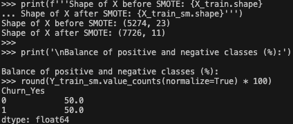

## Methodology
In order to predict whether or not the customers will churn, four different types of classification algorithms will be evaluated, including **logistic regression**, **random forests**, **support vector machine**, and **k-nearest neighbors**. The total predictors consist 11 variables, which explain 85% of variance in the dataset. 

The baseline models will be evaluated prior to hyperparameter optimization. To reduce the bias, 3-fold cross validation will be used in combanation with the model. Each model will be then tested on the out of sample dataset which is more representative of the true class distribution. 

Three evaluation metrics - `precision` , `recall` , and `f1-score` will be used for model evaluation. Accuracy will not be used for model evaluation as it is possible to have a high accuracy score by simply classififying all observations as majority class. 

**Precision** of a model demontrates the proportion of positive observations that are correctly labelled. **Recall** measures the amount of true positives out of the number of true positives and false negatives. **F1-score** is an average of recall and precision scores, especially when working with imbalance datasets. 

The overall performance of a classifier will be measured using **AUC (Area under the curve) ROC (Receiver Operating Characteristics) curve** at different thresholds**.** The curve will be used as an explanation how good the model is to distinguish between different classes.

## Baseline Models
**Table 3** is the classification reports of all baseline models with pre-selected parameters. All classifiers have around the same precision, recall, and f1-score of 70%, with K-nearest Neighbors has the least score of 66% for precision and f1-score.

The average precision scores suggest that when the outcome is positive (churners), it is correct around 70%, while the average recall scores of 70% and above explains that the model can correctly identify 70% and above of churners.

```python
classifiers = [LogisticRegression(), RandomForestClassifier(), SVC(), KNeighborsClassifier()]

for c in classifiers:
    c.fit(X_train_sm, Y_train_sm)
    y_pred_pca = c.predict(X_test_pca)
    print(classification_report(Y_test, y_pred_pca))
```
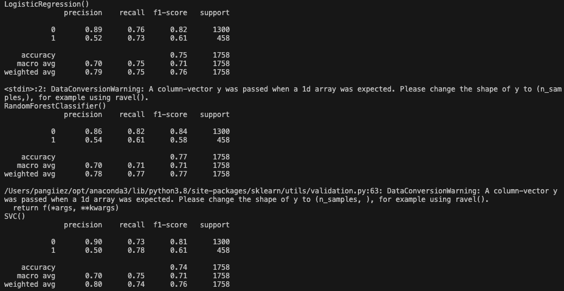


| Model | Precision | Recall | Accuracy | F1-score |
| ----- | --------- | ------ | -------- | -------- |
| Logistic Regression | 0.70 | 0.75 | 0.75 | 0.71 |
| Random Forest | 0.70 | 0.72 | 0.77 | 0.71 |
| Support Vector Machine | 0.70 | 0.75 | 0.74 | 0.71 |
| K-nearest Neighbors | 0.66 | 0.70 | 0.70 | 0.66 |

## Hyperparameter Optimization
### Logistic Regression
Logistic regression is a parametric machine learning algorithm using the probabilistic framework called maximum likelihood estimation to calculate the probability of the outcome. This can be optimised by the set of parameters that results in the largest sum likelihood over the training data (Browniee J. ‘A Gentle Introduction to Logistic Regression With Maximum Likelihood Estimation, 2019).

The solver `liblinear` was set to solve multi-class logistic regression with one-vs-rest problem (y = 1 vs. not 1) of this dataset. The advantage of liblinear is that it performs well with high dimensionality.

`l1` regularisation (Lasso regression) was used as a penalisation parameter to shrink some of the coefficients to zero, in contract to L2 regularisation (Ridge regression) which only the coefficients to be smaller.

The `param_grid_lr` specifies `C` parameter which was explored using `GridSearchCV`. C values signify strength of the regularization, ranging from 1, 0.5, 0.25, 0.1, 0.05, 0.025, 0.01, 0.005, 0.0025. Smaller values have more regularization.

**Best estimator:** `C` values = 0.05. The total number of feature variables was reduced from 11 to 8 features.

```python
logreg = LogisticRegression(penalty='l1', solver='liblinear')
C = [1, .5, .25, .1, .05, .025, .01, .005, .0025]
param_grid_lr = {'C': C}
searchCV = GridSearchCV(logreg, param_grid_lr, cv=3)
searchCV.fit(X_train_sm, Y_train_sm)

logreg_best = searchCV.best_estimator_ 
coefs = logreg_best.coef_
print("Total number of features:", coefs.size) 
print("Number of selected features:", np.count_nonzero(coefs)) 

logreg_best.fit(X_train_sm, Y_train_sm.values.ravel())
logreg_best_y_pred = logreg_best.predict(X_test_pca)
print(classification_report(Y_test, logreg_best_y_pred)) 
```


### Random Forest
Random Forest is an ensemble method using a decision tree as a base estimator. Each estimator is trained on a random subset of bootstrapped samples, commonly referred as sampling with replacement. Once trained, each estimator will output a prediction which then is collected by the random forest meta-classifier. For classification, the final prediction is made by majority voting.

In order to optimise the model’s performance, `GridSearchCV` was used to explore hyper parameters inclusing number of trees in the forest (`n_estimators`), `criterion`, maximum number of levels in each decision tree (`max_depths`), minimum number of data points placed in a node before a node is split (`min_samples_split`), minimum of data points allowed in a leaf node (`min_samples_leaf`), and a bootstrapped method of sampling data points.

**Best estimator:**  `criterion`=entropy, `max_depth`=40, `min_samples_leaf`=3, `n_estimators`=400

```python
rf_params_grid = {'n_estimators': [300, 400, 500],
               'criterion': ['gini', 'entropy'],
               'max_depth': [30, 40, 50],
               'min_samples_split': [2, 3, 4, 5],
               'min_samples_leaf': [3, 4, 5],
               'bootstrap': [True]}
rf = RandomForestClassifier()
rf_searchCV = GridSearchCV(estimator=rf, param_grid=rf_params_grid, cv=3, 
                            n_jobs = -1, verbose = 2)
rf_searchCV.fit(X_train_sm, Y_train_sm.values.ravel())
rf_best = rf_searchCV.best_estimator_ 
rf_best.fit(X_train_sm, Y_train_sm.values.ravel())
rf_best_y_pred = rf_best.predict(X_test_pca)
print(classification_report(Y_test, rf_best_y_pred))
```


### Support Vector Machine
Support Vector Machine is a non-parametric method, which means that the algorithm does not make an assumption about the underlying function, other than patterns of the dataset. The model determines the location of a threshold using so-called the soft margin to make classification. It then forms a hyperplane to classify new observations by looking at which side the new observation is located on the plane mass.

Though a linear classifier as logistic regression, Support Vector Machine uses kernel functions to perform feature transformation. The model uses a default kernel called **Radial Basis Function (RBF)** which behaves like a weighted nearest neighbour by finding the closest observations.

In order to control the shape of the decision boundary, `svc_params_grid` defines `C` parameter that controls regularisation and `gamma` that controls the smoothness of the boundary - lesser gammer means that the boundary becomes smoother.

**Best estimator:**  `C`=10, and `gamma`=0

```python
svc_params_grid = {'C':[0.1, 1, 10], 'gamma':[0.00001, 0.0001, 0.001, 0.01, 0.1]}
svm = SVC(probability=True)
svc_searchCV = GridSearchCV(svm, svc_params_grid, cv=3, n_jobs=-1, verbose=2)
svc_searchCV.fit(X_train_sm, Y_train_sm.values.ravel())
svc_best = svc_searchCV.best_estimator_
svc_best.fit(X_train_sm, Y_train_sm.values.ravel())
svc_best_y_pred = svc_best.predict(X_test_pca) 
print(classification_report(Y_test, svc_best_y_pred)) 
```


### K-nearest Neighbors
K-Nearest Neighbours is another commonly used non-parametric machine learning algorithm. The model essentially creates a set of decision boundaries and predicts the label of a data point based on the most similar training patterns that are close.

`knn_params_grid` defines parameters to find the optimal values - `leaf_size` , `n_neighbors`, and `p` which is a power parameter 

**Best estimator:** `leaf_size`= 21, `n_neighbors`= 1, `p`=2 (euclidean_distance)

```python
leaf_size = list(range(1,50))
n_neighbors = list(range(1,30))
p=[1,2]
knn_params_grid = dict(leaf_size=leaf_size, n_neighbors=n_neighbors, p=p)
knn = KNeighborsClassifier()
knn_searchCV = GridSearchCV(knn, knn_params_grid, cv=3, n_jobs=-1, verbose=2) 
knn_searchCV.fit(X_train_sm, Y_train_sm.values.ravel())
knn_best = knn_searchCV.best_estimator_
knn_best_y_pred = knn_best.predict(X_test_pca)
print(classification_report(Y_test, knn_best_y_pred)) 
```


## Model Evaluation

**Table 3** summaries all important metrics including precision, recall, accuracy, and f1 scores. In order to seek balance between precision and recall, f1-score will be used for model evaluation. Out of the four classifiers, Random Forest has the highest F1-score - 73%. 

| Model | Precision | Recall | Accuracy | F1-score |
| ----- | --------- | ------ | -------- | -------- |
| Logistic Regression | 0.70 | 0.75 | 0.75 | 0.71 |
| Random Forest | 0.72 | 0.74 | 0.78 | 0.73 |
| Support Vector Machine | 0.71 | 0.76 | 0.74 | 0.71 |
| K-nearest Neighbors | 0.64 | 0.66 | 0.74 | 0.65 |

## ROC AUC Curve
However, it is seen from the classification report that the prediction between classes (0 and 1) is heavily imbalanced. ROC AUC metric was used to measure the classification model’s performance as it is utmost important to identify churners (true positives) in this case. 

The ROC curve has two parameters 1) diagnostic sensitivity that demonstrates a proportion of true positive results of churners and 2) diagnostic specificity that demonstrates a proportion of false negative results of non-churners. The curve plots True Positive Rate (TPR) against False Positive Rate (FPR) at different thresholds which give a probability of a binary outcome. AUC meausres how accurate the model is at distinguishing different classes and can be used as a summary of the model skill. 

If AUC is equal to 0.5, it means that the classifier is not able to distinguish classes. AUC is able to distinguish classes by measuring the entire area underneath the ROC curve, ranging from more than 0.5 to 1. 

**Figure 9** delineates the comparison of ROC curve on test set. The diagonal blue line represents the model with no skill at each threshhold at the point (0.5,0.5) and has AUC score of 50%. 

The figure shows that Logistic Regression has the highest AUC score of 82%, suggesting the probability that a randomly chosen positive instance is ranked higher than a randomly chosen negative instance.

```python
logreg_y_pred_proba =logreg_best.predict_proba(X_test_pca)[:,1]
logreg_test_roc_auc = roc_auc_score(Y_test, logreg_y_pred_proba) 
print('Test set ROC AUC score: {:.3f}'.format(logreg_test_roc_auc)) 

rf_y_pred_proba = rf_best.predict_proba(X_test_pca)[:,1]
rf_test_roc_auc = roc_auc_score(Y_test, rf_y_pred_proba) 
print('Test set ROC AUC score: {:.3f}'.format(rf_test_roc_auc)) 

svc_y_pred_proba = svc_best.predict_proba(X_test_pca)[:,1]
svc_test_roc_auc = roc_auc_score(Y_test, svc_y_pred_proba) 
print('Test set ROC AUC score: {:.3f}'.format(svc_test_roc_auc)) 

knn_y_pred_proba = knn_best.predict_proba(X_test_pca)[:,1]
knn_test_roc_auc = roc_auc_score(Y_test, knn_y_pred_proba)
print('Test set ROC AUC score: {:.3f}'.format(knn_test_roc_auc)) 

# Plot ROC AUC Curve
ns_probs = [0 for _ in range(len(Y_test))]
ns_auc = roc_auc_score(Y_test, ns_probs)
ns_fpr, ns_tpr, _ = roc_curve(Y_test, ns_probs)

lr_fpr, lr_tpr, _ = roc_curve(Y_test, logreg_y_pred_proba)
rf_fpr, rf_tpr, _ = roc_curve(Y_test, rf_y_pred_proba)
svc_fpr, svc_tpr, _ = roc_curve(Y_test, svc_y_pred_proba)
knn_fpr, knn_tpr, _ = roc_curve(Y_test, knn_y_pred_proba)

plt.style.use('fivethirtyeight')
plt.plot(ns_fpr, ns_tpr, linestyle='--',label='No Skill Classifier')
plt.plot(lr_fpr, lr_tpr,marker='.',label='Logistic Regression = 0.82')
plt.plot(rf_fpr, rf_tpr,marker='.',label='Random Forest = 0.81')
plt.plot(svc_fpr, svc_tpr,marker='.',label='Support Vector Machine = 0.81')
plt.plot(knn_fpr, knn_tpr,marker='.',label='K Nearest Neighbors = 0.66')

plt.xlabel('False Positive Rate (Sensitivity)')
plt.ylabel('True Positive Rate (1-Specificity)')
plt.legend()
plt.title('ROC Curve Comparison on the Test Set', weight='bold')
plt.tight_layout()
plt.show()
```


## Conclusion
- The original dataset has 23 features, after applying PCA, the features were reduced to 11. With 11 features, we can explain around 85% of the variance in the dataset.
- Important factors include `TotalCharges`, `MonthlyCharges`, `tenure`, `StreamingMovies`, `StramingTV`, `DeviceProtection`, `OnlineBackup`, `MultipleLines`, `InternetService_Fiber optic`, `TechSupport`, `OnlineSecurity`
- Although Random Forest has the highest f1-score which gives an average between precision and recall, AUC score is a better metric in evaluating the model’s performance especially when dealing with imbalanced dataset in this case. Logistic Regression should therefore be used as it produced the highest AUC score of 82%.
- To implement customer retention strategies, Telco should focus on promoting campaigns to get the customers sign up for the additional services mentioned above, as well as improving the quality of services. Annual service subsciptions should also be promoted to improve retention and the company's cashflow.